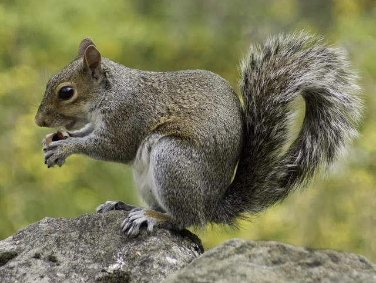

# PNGPart - Partition-based lossy PNG compression

PNGPart is an image partitioning algorithm. Combined with
[oxipng](https://github.com/shssoichiro/oxipng) it can compress PNGs down to
[68%](#benchmark) of their original (oxipng optimized) size with almost no
visible quality loss.

This repo is a Rust implementation of the algorithm and a basic CLI tool that
also incorporates oxipng for optimal PNG encoding.

## Algorithm

| High tolerance               | Medium tolerance             | Low tolerance                |
| ---------------------------- | ---------------------------- | ---------------------------- |
|  |  |  |

The algorithm iteratively divides the image into axis-aligned regions. Each
region is colored with its average color. In every iteration, the region with
the most variance in color is divided in the middle of the axis that minimises
both subsections' variance.

The algorithm can be stopped at any time, and more iteration equals better
quality but reduces compression rate. Instead of using a fixed iteration count,
the tolerance is used instead as the stopping criteria. This means that the
algorithm will stop when the maximum variance falls below a certain
threshold.

## Installation and usage

PNGPart can be built from source using Rust.

```sh
git clone https://github.com/ziap/pngpart
cd pngpart

cargo build --release

# Usage
target/release/pngpart <input file> <output file>
```

## Benchmark

A benchmark is performed on the validation set of the
[DIV2K](http://data.vision.ee.ethz.ch/cvl/DIV2K/DIV2K_valid_HR.zip) dataset.

The algorithm is compared with another lossy PNG compressor, namely
[pngquant](https://pngquant.org/). For a fairer comparison,
[oxipng](https://github.com/shssoichiro/oxipng) is run on the output of both
algorithms and also on the original image. Both algorithms are run on their
default settings.

| Metric           | PNGPart    | pngquant   |
| ---------------- | ---------- | ---------- |
| Output size (Kb) | 285439     | **149748** |
| Compression rate | 68.00%     | **35.68%** |
| MSE              | **2.60**   | 11.33      |
| PSNR             | **44.14**  | 38.69      |
| SSIM             | **0.9871** | 0.9848     |

This shows that while PNGPart has a worse compression ratio, the image quality
is slightly better based on many common image comparison metrics. Note that
these metrics don't really reflect the perceptual image quality, and the
output of pngquant is also almost indistinguishable from the original image.

## Licence

This project is licensed under the [MIT Licence](LICENSE).
